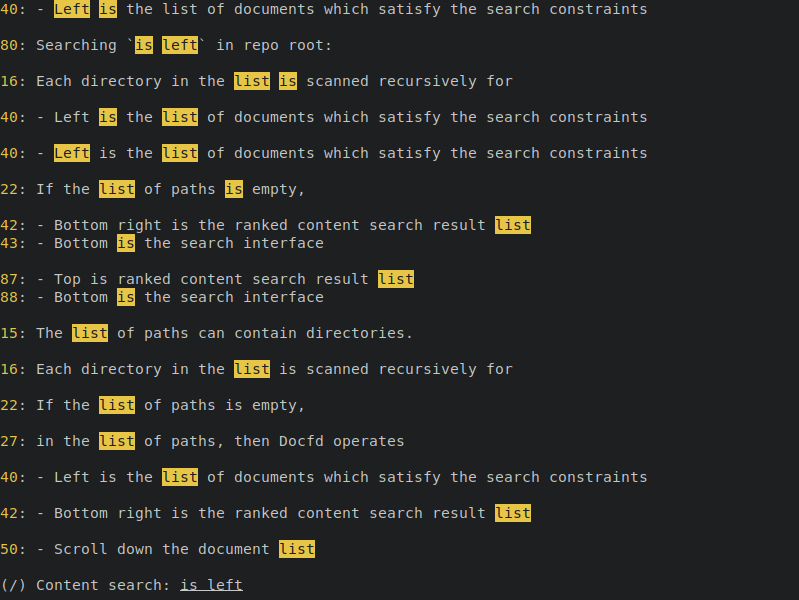
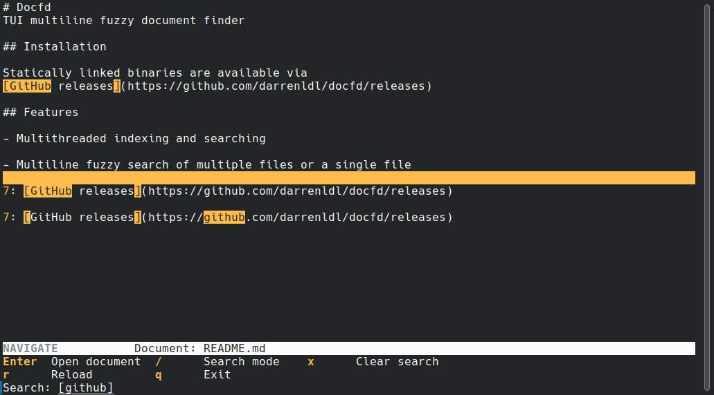

# Docfd
TUI multiline fuzzy document finder

## Installation

Statically linked binaries are available via
[GitHub releases](https://github.com/darrenldl/docfd/releases)

## Features

- Multithreaded indexing and searching

- Multiline fuzzy search of multiple files or a single file

- Swap between multi-file view and single file view on the fly

- Content view pane that shows the snippet surrounding the search result selected

## Usage

#### Read from piped stdin

```
command | docfd
```

Docfd uses **Single file view**
when source of document is piped stdin.

Files specified as arguments to docfd are ignored
in this case.

#### Read from files

```
docfd [PATH...]
```

The list of paths can contain directories.
Each directory in the list is scanned recursively for
files with one of the following extensions by default:

- `.txt`
- `.md`
- `.pdf`

You can change the file extensions to use via `--exts`.

If the list of paths is empty,
then Docfd defaults to scanning the
current directory `.`.

If any of the file ends with `.pdf`, then `pdftotext`
is required to continue.

If exactly one file is specified
in the list of paths, then Docfd uses **Single file view**.
Otherwise, Docfd uses **Multi-file view**.

## Multi-file view


The default TUI is divided into four sections:
- Left is the list of documents which satisfy the search phrase
- Top right is the content view of the document which tracks the search result selected
- Bottom right is the ranked search result list
- Bottom pane consists of:
    - Status bar
    - Key binding info
    - File content requirement field
    - Search field

#### Controls

<details>

Docfd operates in modes, the initial mode is `Navigation` mode.

`Navigation` mode
- Scroll down the document list
    - `j`
    - Down arrow
    - Page down
    - Scroll down with mouse wheel when hovering above the area
- Scroll up the document list
    - `k`
    - Up arrow
    - Page up
    - Scroll up with mouse wheel when hovering above the area
- Scroll down the search result list
    - `Shift`+`j`
    - `Shift`+Down arrow
    - `Shift`+Page down
    - Scroll down with mouse wheel when hovering above the area
- Scroll up the document list
    - `Shift`+`k`
    - `Shift`+Up arrow
    - `Shift`+Page up
    - Scroll up with mouse wheel when hovering above the area
- Open document
    - `Enter`
        - Docfd tries to use `$VISUAL` first, if that fails then Docfd tries `$EDITOR`
- Switch to single file view
    - `Tab`
- Switch to `Require content` mode
    - `?`
- Switch to `Search` mode
    - `/`
- Clear search phrase
    - `x`
- Exit Docfd
    - `q` or `Ctrl+c`

`Search` mode
- Search field is active in this mode
- `Enter` to confirm search phrase and exit the mode

`Require content` mode
- Required content field is active in this mode
- `Enter` to confirm file content requirements and exit the mode

</details>

#### Search phrase and search procedure

<details>

Document content and user input in the search field are tokenized/segmented
in the same way, based on:
- Contiguous alphanumeric characters
- Individual symbols
- Individual UTF-8 characters
- Spaces

A search phrase is a list of said tokens.

Search procedure is a DFS through the document index,
where the search range for a word is fixed
to a configured range surrounding the previous word (when applicable).

A token in the index matches a token in the search phrase if they are:
- A case-insensitive exact match
- Or a case-insensitive substring match (token in search phrase being the substring)
- Or within the configured case-insensitive edit distance threshold

Search results are then ranked using heuristics.

</details>

#### File content requirements

<details>

The required content field accepts a content requirement expression.

A content requirement expression is one of:
- Search phrase
- `(expression)`
- `expression & expression`
- `expression | expression`

Note that the edit distance is not considered here.
Only case-insensitive exact matches or substring matches against
the search phrases are considered.

In other words, given the same phrase,
it is treated less fuzzily as a content requirement expression
compared to being used as a search phrase in the search field.

</details>

## Single file view

If the specified path to Docfd is not a directory, then single file view
is used.





In this view, the TUI is divided into only two sections:
- Top is ranked search result list
- Bottom is the search interface

#### Controls

<details>

The controls are simplified in single file view,
namely `Shift` is optional for scrolling through search result list.

`Navigation` mode
- Scroll down the search result list
    - `j`
    - Down arrow
    - Page down
    - `Shift`+`j`
    - `Shift`+Down arrow
    - `Shift`+Page down
    - Scroll down with mouse wheel when hovering above the area
- Scroll up the document list
    - `k`
    - Up arrow
    - Page up
    - `Shift`+`k`
    - `Shift`+Up arrow
    - `Shift`+Page up
    - Scroll up with mouse wheel when hovering above the area
- Open document
    - `Enter`
        - Docfd tries to use `$VISUAL` first, if that fails then Docfd tries `$EDITOR`
- Switch to multi-file view
    - `Tab`
- Switch to `Search` mode
    - `/`
- Clear search phrase
    - `x`
- Exit Docfd
    - `q` or `Ctrl+c`

`Search` mode
- Search field is active in this mode
- `Enter` to confirm search phrase and exit search mode

</details>
