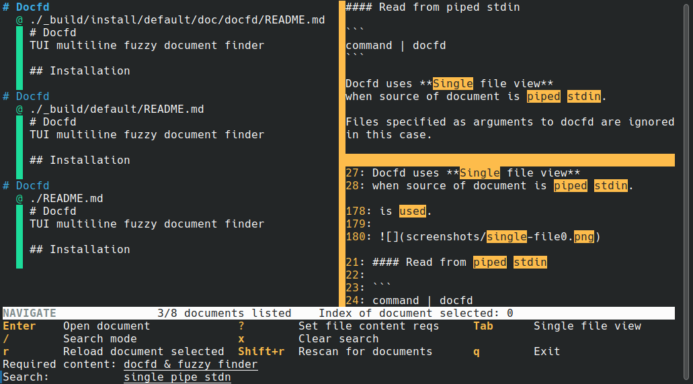
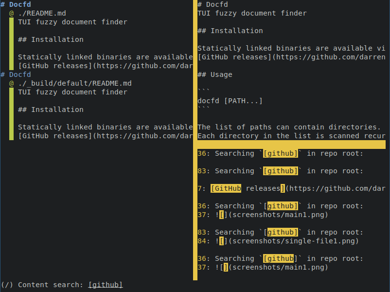

# Docfd
TUI fuzzy document finder

## Installation

Statically linked binaries are available via
[GitHub releases](https://github.com/darrenldl/docfd/releases)

## Usage

Docfd scans for files recursively (defaults to `.`) with the following extensions:

- `.md`
- `.txt`

and builds an index of the "document" content.

Searching `left is` in repo root:


Searching `[github]` in repo root:


The TUI is divided into three sections:
- Left is the list of documents which satisfy the search constraints
- Top right is the preview of the document
- Bottom right is the ranked content search result list
- Bottom bar is the search interface

### Controls

Docfd operates in modes, the initial mode is `NAVIGATION` mode

`NAVIGATION` mode
- Scroll down the document list
  - `j` or down arrow
  - Scroll down with mouse wheel when hovering above the area
- Scroll up the document list
  - `k` or up arrow
  - Scroll up with mouse wheel when hovering above the area
- Scroll down the content search result list
  - `Shift`+`j` or `Shift`+Down arrow
  - Scroll down with mouse wheel when hovering above the area
- Scroll up the document list
  - `Shift`+`k` or `Shift`+Up arrow
  - Scroll up with mouse wheel when hovering above the area
- Open document
  - `Enter`
    - Docfd tries to use `$VISUAL` first, if that fails then Docfd tries `$EDITOR`
- Switch to `CONTENT SEARCH` mode
  - `/`
- Exit Docfd
  - `q` or `Ctrl+c`

`CONTENT SEARCH` mode

- Content search field is active in this mode
- `Enter` to confirm search constraints and exit search mode

## Advanced usage

Docfd recognizes "note" files, which can contain tags.
A file is classified as a note if scans a given directory recursively (defaults to `.`),
and processes files with names which contain "note" or "notes" after splitting on '.', e.g.
`meeting.notes.md`, `timetable.note`, `note`.

If any such file is detected, then tag related UI components and control become visible.

A header consists of two main sections: title and tags.

Title is simply all text before the tag section (if present).

Tags are specified in `[]`, `||`, or `@@` as space separated list of words.
Tags cannot contain spaces or the delimiter chosen for the section.
Tag section must be specified within a single line.

An example header reads as follows:
```
Meeting YYYY-MM-DD
[ tag0 tag1 tag2 ... ]
```

The remainder of the file is considered content, and is indexed
in the same way as a document.

### Tag search

The following types of tag matches are available:

- `-e` [E]xact tag match
- `-f` [F]uzzy case-insensitive tag match
- `-i` Case-[i]nsensitive full tag match
- `-s` Case-insensitive [s]ubstring tag match

All search constraints are chained together by "and".

### List tags

- `--tags` List all tags used
- `--ltags` List all tags used in lowercase

## Other valid header structure

### Multiline title
```
Meeting YYYY-MM-DD
About topic ABC
[ tag0 tag1 tag2 ... ]
```

The final title computed by Notefd is simply all title lines
concatenated using ` `, i.e. `Meeting YYYY-MM-DD About topic ABC`.

### Missing tag section
```
Meeting YYYY-MM-DD
About topic ABC
```

The first line is used as the final title.

### Multiple consecutive tag sections
```
Meeting YYYY-MM-DD
About topic ABC
[ tag0 tag1 tag2 ... ]
[ tagA ]
| tagB ... |
```

The final set of tags is the union of all specified tags.
